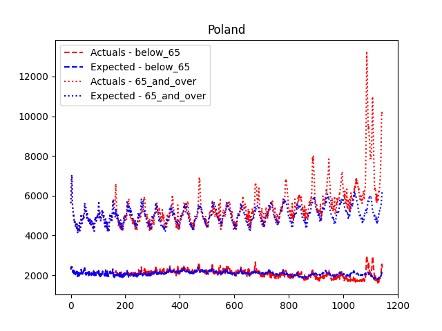
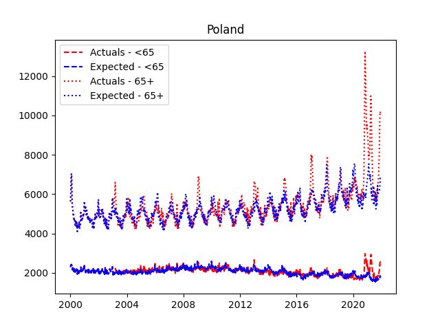
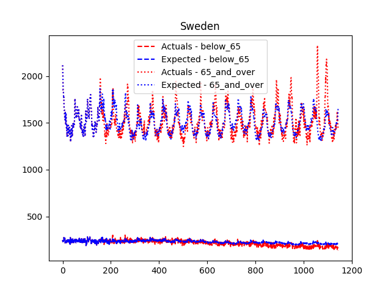
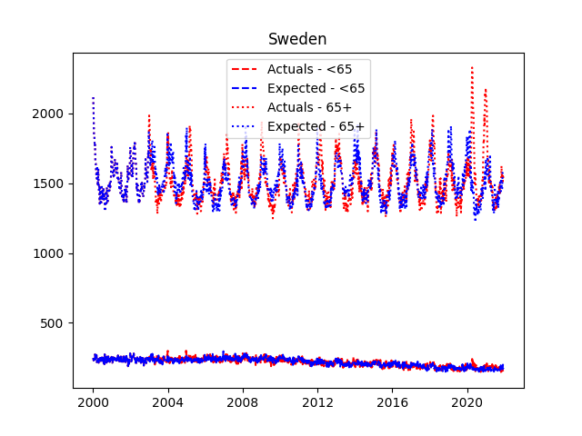

# Mortality Monitor

- [Mortality Monitor](#mortality-monitor)
- [Installation](#installation)
  - [Backend](#backend)
  - [Frontend](#frontend)
- [Running the application locally](#running-the-application-locally)
- [Methodology for expected deaths](#methodology-for-expected-deaths)
  - [Number of considered lookback years](#number-of-considered-lookback-years)
    - [Case study: Poland](#case-study-poland)
    - [Case study: Sweden](#case-study-sweden)
  - [Miscellaneous](#miscellaneous)

This application visualizes all-cause mortality on a weekly basis for all countries and age groups found in the Eurostat [**demo_r_mweek3**](https://appsso.eurostat.ec.europa.eu/nui/show.do?dataset=demo_r_mweek3&lang=en) table. It also computes an expected value with a sample 'past average plus growth' model  which allows to visualize excess deaths as well.

The application gets new data once a day directly from Eurostat.

The application can be accessed here: https://pombolutador.github.io/

# Installation

The application is divided into a small small  `flask` server which provides the VueJS frontend with data. 

## Backend
To install the backend follow the following steps:

- Run `bash bin/create_environment.sh`. Python 3.8 should be installed, as well as the  `virtualenv` package.
- Run `source bin/install_dependencies.sh`. This will install all development dependencies (such as formatters, linters and pytest) as well. Note that it has to be run via `source` and not `bash`, otherwise the packages won't be installed into the virtual envrionment.

## Frontend

NodeJS needs to be installed on the system.

- Run `npm install` from the `frontend` folder.

# Running the application locally

- Spin up the `flask` server by executing `mortality_monitor/server.py` from inside the virtual environment created above. This will expose the server to your local network.
- Replace the string `<placeholder>` in `frontend/src/components/home_page.vue` with the IP and port of the `flask` server (which it should print out when spinning up).
- Spin up the VueJS frontend by running `npm run serve` from inside of the `frontend` folder.

# Methodology for expected deaths

Let `p_t` be a period for which we want to predict an expected deaths value. Actual deaths prior to `p_t`are considered. 

The model will retrieve `num_lookback_years` by looking up values at `p_t-52 weeks`, `p_t-2*52 weeks`, ... etc. Outliers are removed from these values by calculating lower- and upper bounds via `mean +- standard deviation`. The average of these `num_lookback_years` values is the base of the prediction.

The growth component is added by retrieving (at least two and up to) `num_lookback_years` yearly sums. These are retrieved by summing up all values between `p_t-2*52 weeks` and `p_t-52 weeks`, `p_t-3*52 weeks` and `p_t-2*52 weeks` and so forth. A linear regression is fitted through these values and extrapolated to the year of `p_t`. The extrapolated value is normalized w.r.t. the first lookback year's sum to arrive at a prediction for the growth. This is applied to the base value computed above:

`Prediction(p_t) ~ mean(lookback_values)*yearly_growth`

Note that the model thus has an effective forecasting horizon of 52 weeks. This means that on - for example - `2020-15` the expected values for `2021-15` can already be calculated.

## Number of considered lookback years

Currently the value for `num_lookback_years` is set to 3 due to a small analysis that was done studying the model.Prior to setting the value to 3 all prior available lookback years were considered. This often lead to the model becoming too inflexible and not being able to adjust to new trends. 

### Case study: Poland

Consider for example the graph of expected (and actual) deaths for `Poland` (split into age groups `65+` and `<65`):

Especially towards the end the model cannot adjust to rising numbers for the `65+` age group because it has to consider all values in the past. Expected deaths is thus underforecasted.

The same plot, but considering only the past 3 prior years looks as follows:

The model is much better at adjusting and thus does not massively underforecast towards the end.

### Case study: Sweden

A similar picture can be seen for Sweden but in the `<65` age group:

The blue- and red line start to noticeably diverge midway through the dataset. Only looking at the past 3 years solves this issue while keeping the prediction for the `65+` age group intact:

## Miscellaneous

- There are util shell scripts to format and lint the code which can be run via `bash bin/format.sh` and `bash bin/lint.sh` respectively.
- Tests are run by running `pytest`.